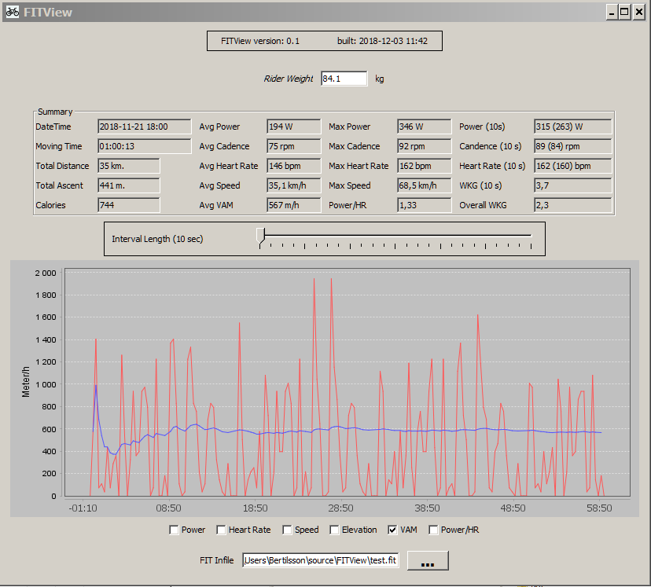


# FITView

FITView is a Java application for viewing FIT (*Flexiable and Interoperability Data Transfer*) training files. The FIT protocol is developed by Garmin and is used by a number of manufactures and applications in the health and exercise segment.
The [Zwift](https://zwift.com/) VR cycling application being one of them. When training on Zwift a FIT file is produced and the user can briefly see the outcome of the exercise, time, distance, elevation and average watts.

I wanted to retreive more detailed information about my exercise so I developed FITView. But at the same time I discovered that Zwift also are connected to Strava and that exercises can be automatically uploaded there.  [Strava](https://www.strava.com/)  could show pretty much everything you are looking for, for free :-)

However I completed the FITView hack, it was small effort and not much time was wasted.
So if you have an interest in the program and/or source here it is.  Maybe it can serve as an inspiration for other ideas. 

Garmin provides an SDK for processing FIT files. The SDK can found [here](https://www.thisisant.com/resources/fit/)
The Graphs are presented with [JFreeChart](http://www.jfree.org/jfreechart/). 

*The program has currently only been tested with output files from Zwift where candence, altitude, speed, power and heart rate data has been available. Displaying files not having all these data variables might result in an unexpected/unwanted result :-) I will happily fix these issues if you send me an example file.*

If you would like to test/use the program there is a zip file on the top level **fitview-*n.n*.zip**
Unzip the file and execute the startfile *fitview.bat* on Windows and *fitview.sh* on Linux platforms. 

